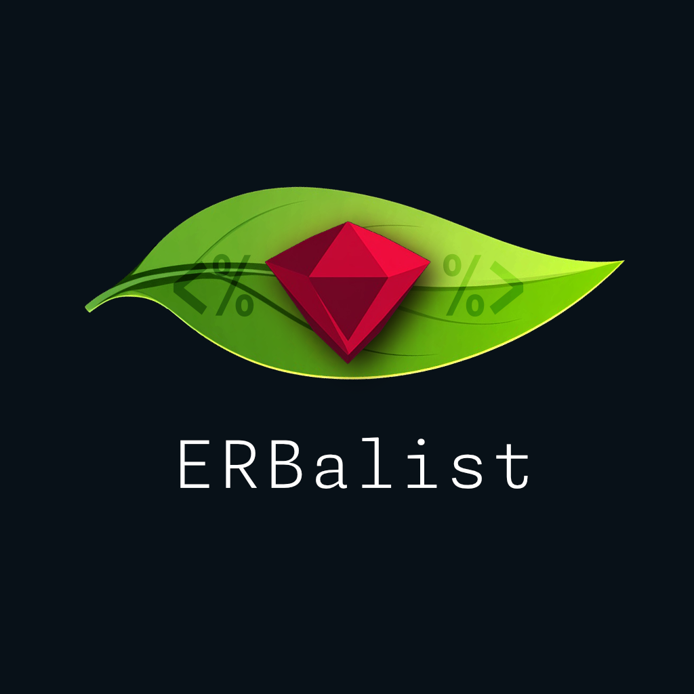
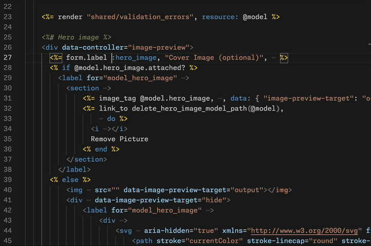
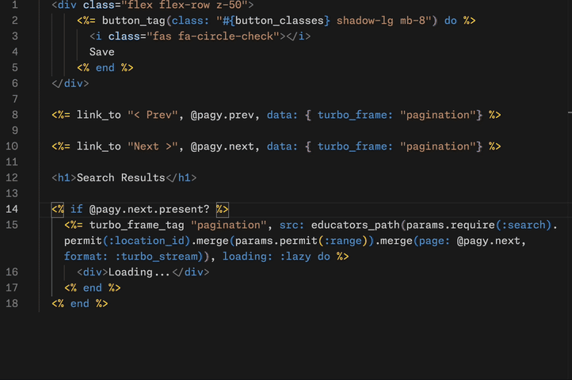
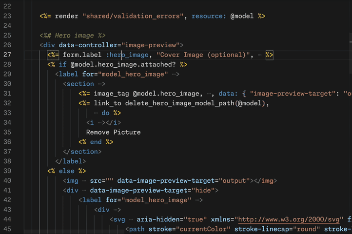
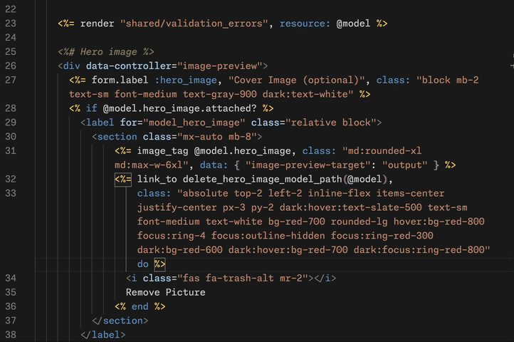
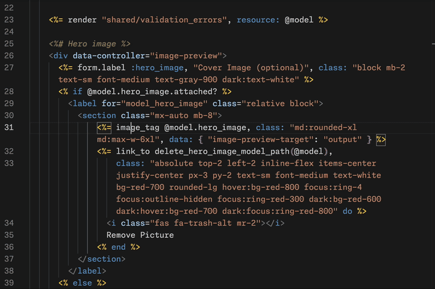

# ERBalist

ERBalist is a VSCode extention that makes it easier to work with ERB files by selectively reducing visual noise and highlighting relationships between different parts of your code.

When working with ERB templates, context matters - are you currently working on styling your presentation using Tailwind, writing server-side ruby logic, or refining client-side behaviour using Stimulus and Turbo? ERB mixes all of these concerns - ERBalist helps you detangle them.

## Features

- **Smart Ruby Focus**: Dims HTML when you're working with Ruby code, letting you focus on control flow
- **Turbo Frame Tracking**: Shows current Turbo Frame scope and related elements referencing the current frame
- **Stimulus Highlighting**: Visualizes controller/target/action/outlet relationships, anywhere in the document
- **Tailwind Class Management**:
  - Folds away those long class strings until you need them
  - Highlights related modifiers (hover:, sm:, dark:, light:md:, etc.) - lets you see at a glance what other classes share the same modifiers
- **SVG Folding**: Fold/unfold all SVG tags in the document - SVG tags can be a bit of a mess, this helps you keep them tucked away if you use them

## Commands and Examples

### Ruby Focus

Command: `ERBalist: Toggle Ruby Focus On/Off`

> Mac: <kbd>cmd+k r</kbd>

> Windows: <kbd>ctrl+k r</kbd>
  

### Turbo Frame Tracking

Command: `ERBalist: Toggle Turbo Frame Tracking On/Off`

> Mac: <kbd>cmd+k t</kbd>

> Windows: <kbd>ctrl+k t</kbd>

### Stimulus Highlighting

### Tailwind Modifiers

### Class Attribute Folding

Command: `ERBalist: Toggle Class Attribute Folding On/Off`

> Mac: <kbd>cmd+k c</kbd>

> Windows: <kbd>ctrl+k c</kbd>

## Extension Settings

This extension contributes the following settings:

* `erbalist.highlightMode`: Controls when Ruby code focus should apply when toggled on
  - `always`: Always focus Ruby code, regardless of cursor position
  - `whenInBlock`: Only focus Ruby code when cursor is within a Ruby code block (default)
* `erbalist.toggleWordWrapWithFolding`: Toggle word wrap when folding class attributes - workaround for a rendering problem caused by VSCode's decoration handling (default: true)

## Known Issues

None yet! Please report any issues on [GitHub](https://github.com/maxvolumedev/erbalist/issues).

## Release Notes

### 1.0.0

Initial release of ERBalist