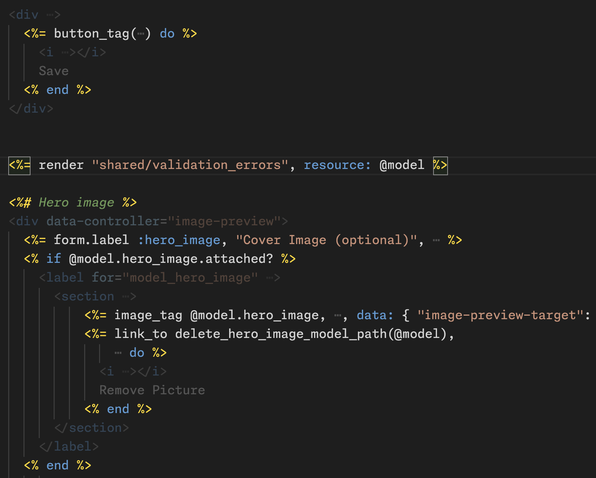
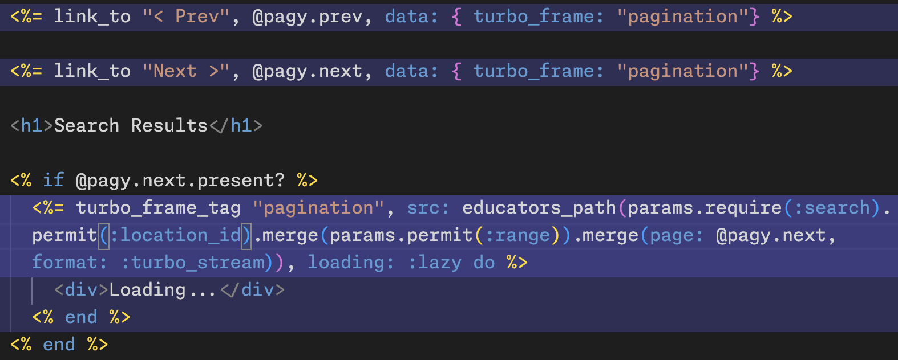
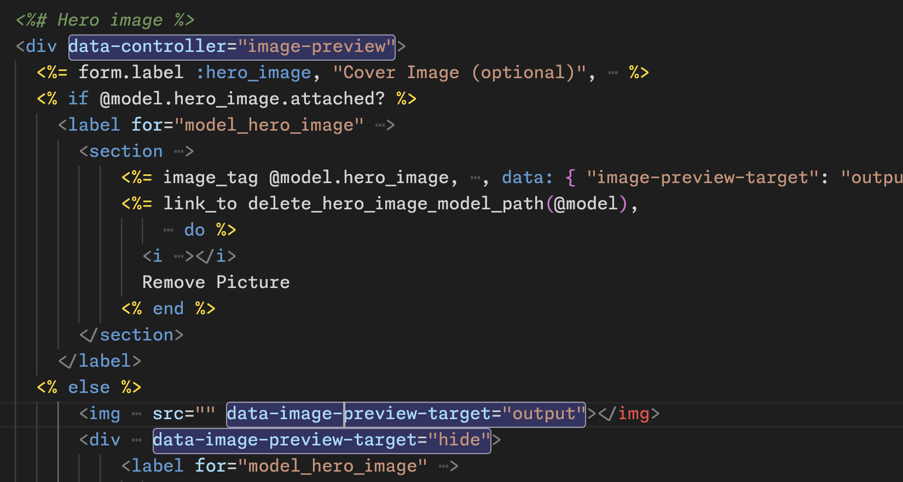
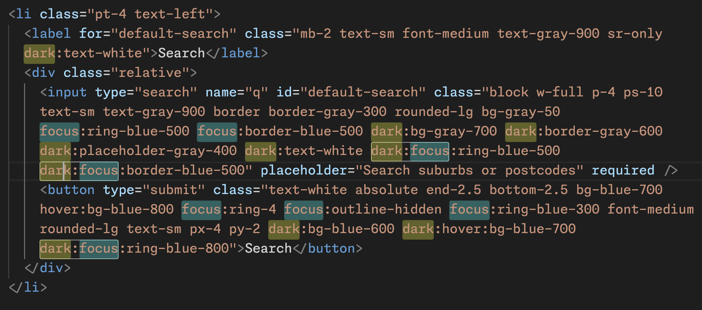
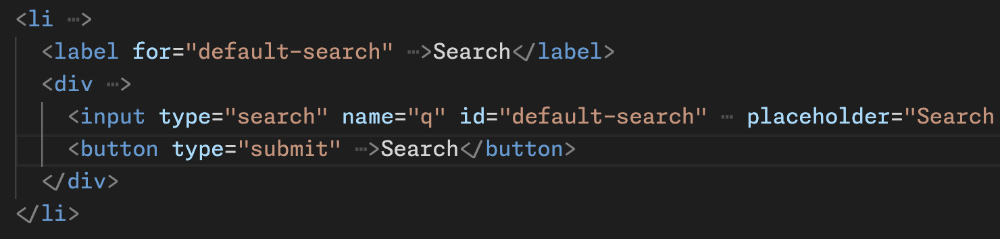

# ERBalist

ERBalist makes your ERB files easier to work with by reducing visual noise and highlighting relationships between different parts of your code.

When working with ERB templates, your current context matters - are you styling your presentation, debugging ruby logic, or refining client-side behaviour using Stimulus and Turbo? ERB mixes all of these concerns - ERBalist helps you detangle them.

## Features

- **Smart Ruby Focus**: Dims HTML when you're working with Ruby code
- **Turbo Frame Tracking**: Shows current Turbo Frame scope and related elements  
- **Stimulus Highlighting**: Visualizes controller/target/action/outlet relationships
- **Tailwind Class Management**:
  - Folds away those long class strings until you need them
  - Highlights related modifiers (hover:, sm:, dark:, etc.)
- **SVG Folding**: Fold/unfold all SVG tags in the document

ERBalist allows you to focus on what matters right now, while helping you keep track of how everything connects together.

Great for Rails apps using modern tools like Hotwire, Stimulus, and Tailwind.

## Examples

### Ruby Focus

### Turbo Frame Tracking

### Stimulus Highlighting

### Tailwind Modifiers

### Class Attribute Folding

## Extension Settings

This extension contributes the following settings:

* `erbalist.highlightMode`: Controls when Ruby code should be emphasized in ERB templates
  - `always`: Always highlight Ruby code
  - `whenInBlock`: Only highlight Ruby code within Ruby blocks (default)
* `erbalist.toggleWordWrapWithFolding`: Toggle word wrap when folding class attributes (default: false)

## Known Issues

None yet! Please report any issues on GitHub.

## Release Notes

### 1.0.0

Initial release of ERBalist
